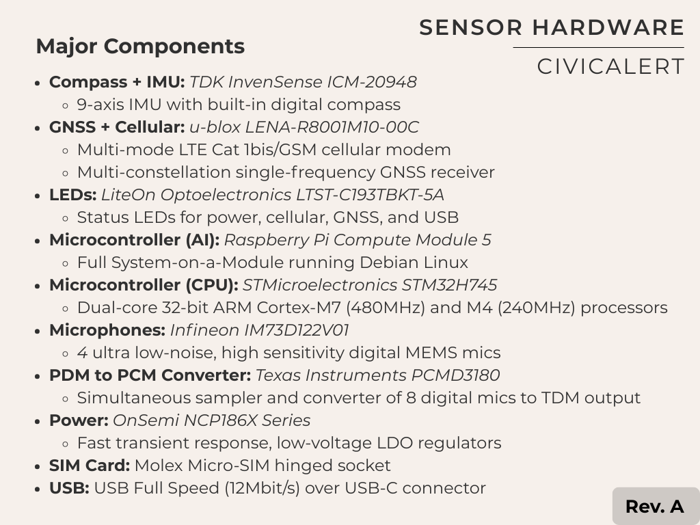
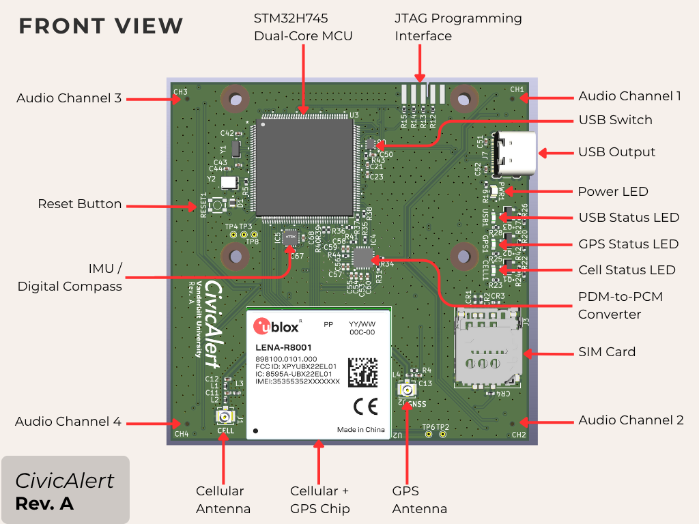
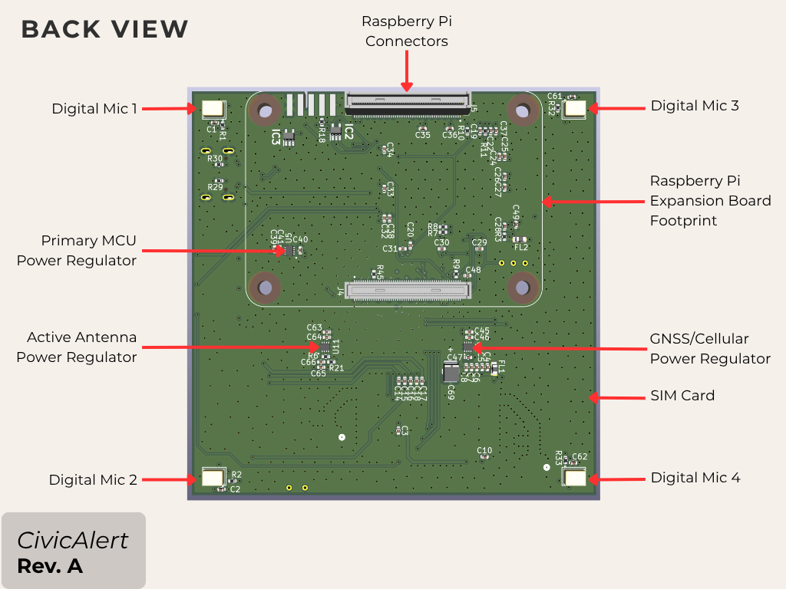
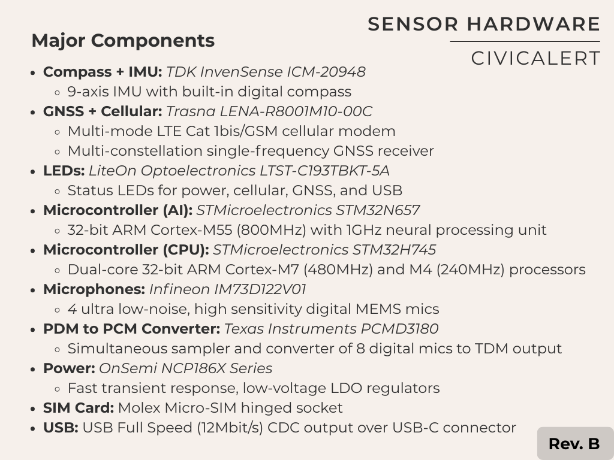

# CivicAlert Hardware Design Repository

This repository contains hardware design files for the CivicAlert sensor device. The design was created
using [KiCad](https://www.kicad.org/download) and requires v9.0.0 or later to open and edit.

## Getting Started

1. Clone this repo on your local machine
2. Download and install [KiCad](https://www.kicad.org/download)
3. Open KiCad
4. Click `File->Open Project`
5. Select `hw.kicad_pro` from the repo root directory

You will be presented with a listing of available KiCad tools for this project. The two most relevant are
the "Schematic Editor" and the "PCB Editor". The Schematic Editor allows you to view and manipulate the
logical connections between hardware components and power networks, while the "PCB Editor" allows you to
view the actual design of the board and layout of the components as they will be placed during
manufacturing and assembly.

The schematic symbols and footprints for all parts and components used in this design have been stored
within the repo itself and should automatically be picked up by KiCad when you open the project. If you
would like to add new parts or alter existing ones, you may use the "Symbol Editor" or "Footprint
Editor" tool, and ensure that any new parts are stored in either `part_symbols/` or `part_footprints/`
so that new parts will be visible and available to others in the future.

Additionally, 3D CAD models for all parts can be found in `part_3d_cads/`, which will be used by KiCad
to generate a 3D rendering of the final assembled board. Finally, all datasheets, application notes,
and relevant part-specific documentation can be in the `datasheets/` folder.

## Revisions

### Revision A
*Release Date: 03-13-2025*

Original prototype version of the hardware. Expected usage includes:

* 4 audio channels to allow computation of 3D angles of arrival
* Digital compass + IMU to align angles of arrival with a global coordinate system
* Multi-constellation GNSS receiver to ensure accurate timestamping in difficult environments
* Micro-SIM card to provide direct connectivity to Thingstream for cellular data offloading
* Event detection and angle of arrival calculations performed on primary MCU
* Event classification and validation performed using AI models on external Raspberry Pi
* Data communication between primary MCU and Raspberry Pi uses USB over internal connector
* Data communication between primary MCU and external debugging machine (PC) uses USB-C connector
* Internal switch automatically routes primary MCU output to correct USB interface depending on the
  presence or absence of a connected Raspberry Pi Compute Module
* Entire board (including Raspberry Pi) is powered from a 5V USB-C cable

Major functionality and components are shown below:

### Revision B
*Release Date: 08-01-2025*

Updated to support edge-based AI and remove the need for an external Raspberry Pi Compute Module:

TODO: Board Designs
